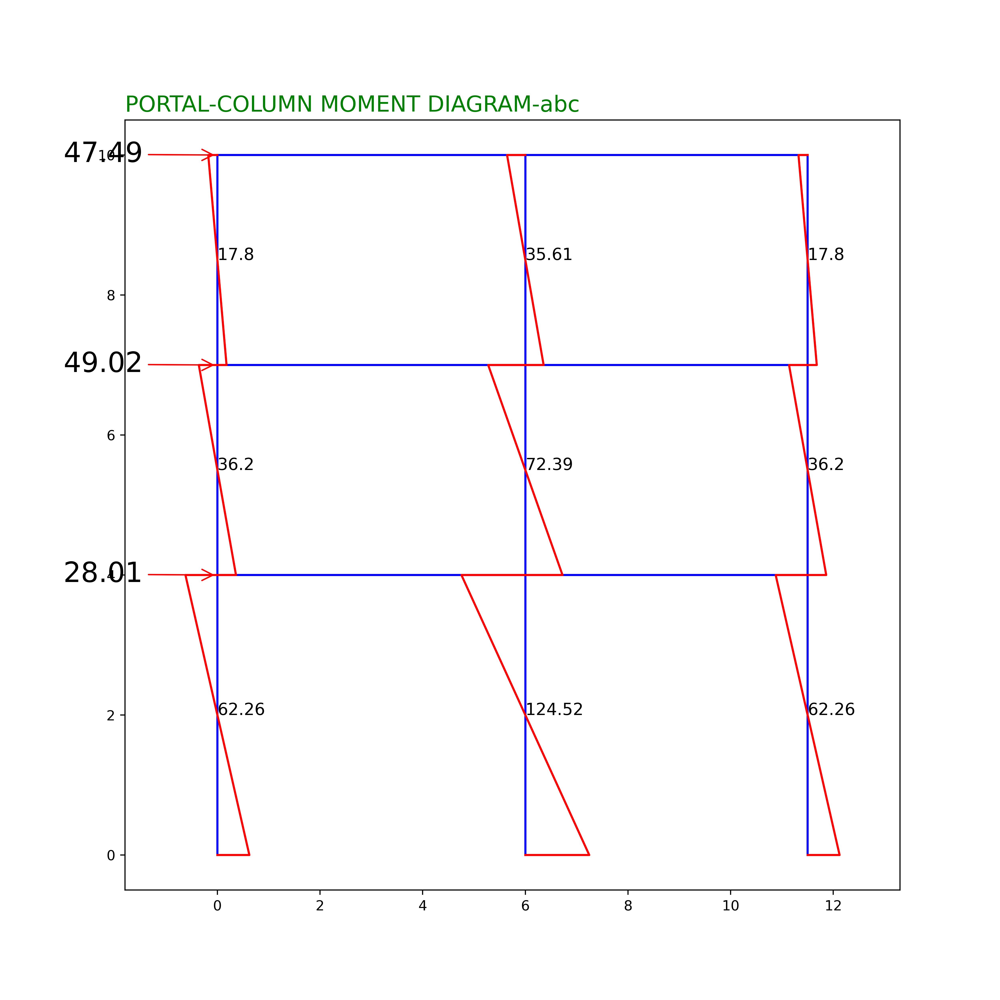
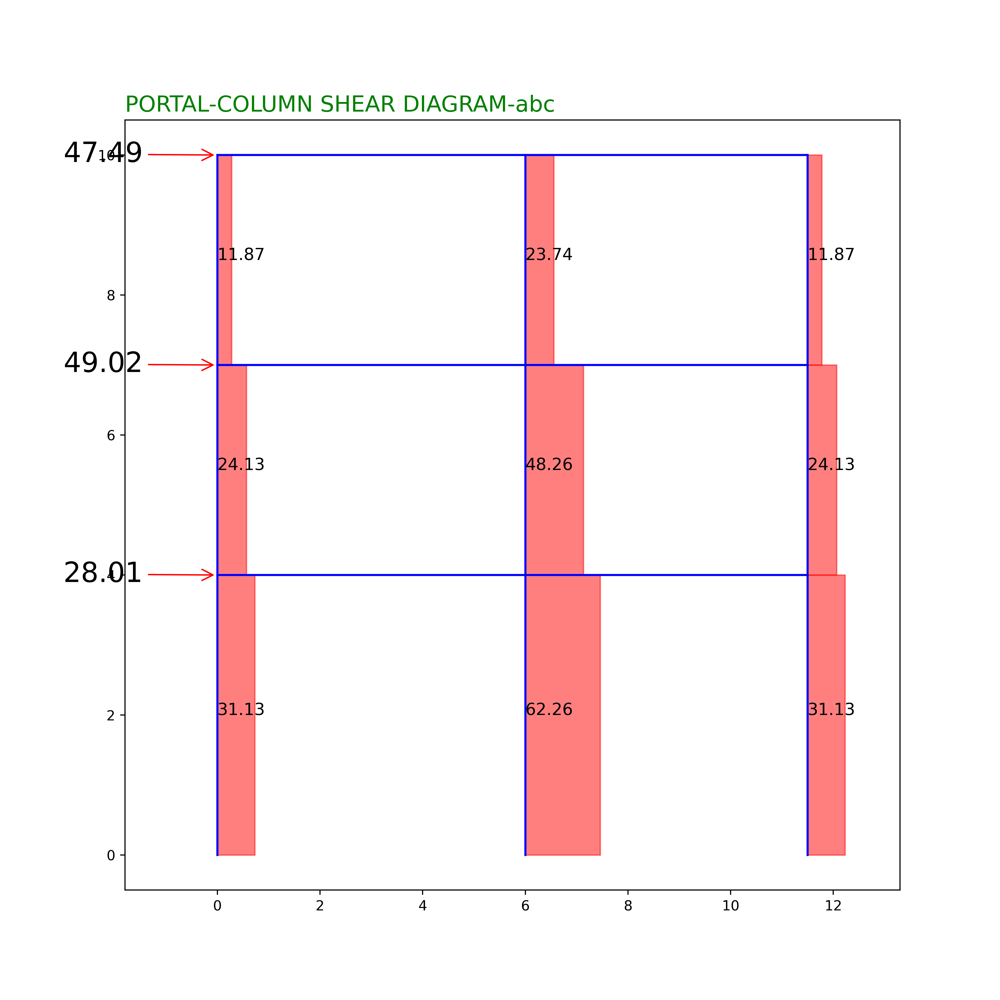
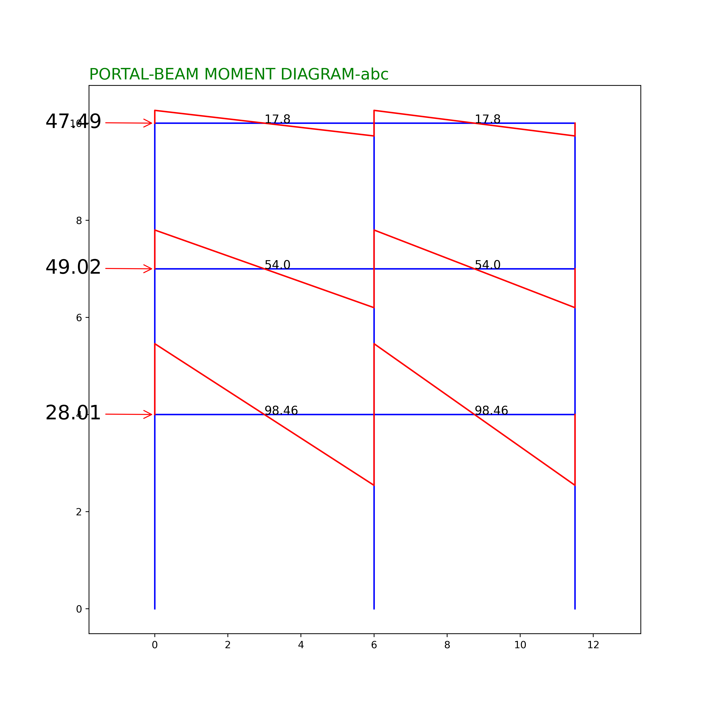
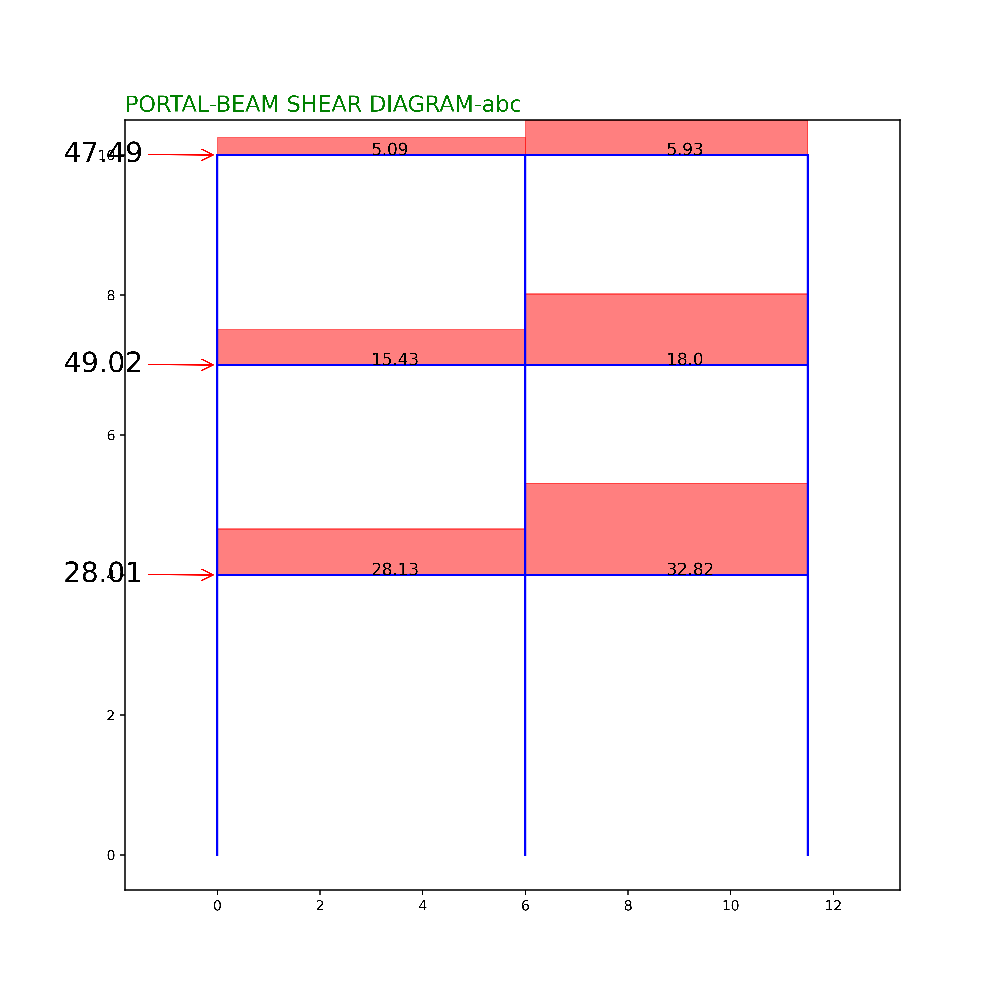
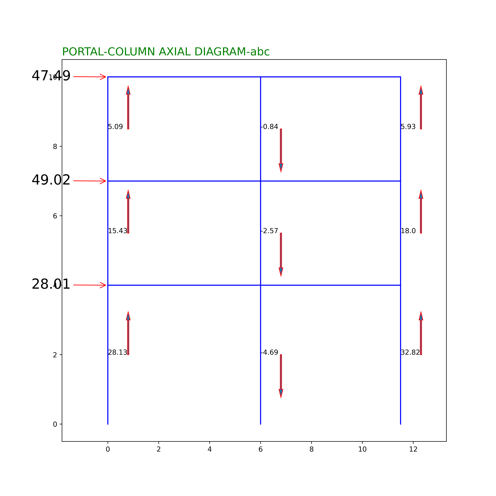

# Portal Frame Analysis Application

A comprehensive structural engineering tool that performs portal frame analysis and design for multi-story, multi-bay steel frames. Features a modern MUI frontend, Python FastAPI backend, and Julia calculation engine with LaTeX-rendered calculations.



## Architecture

```
frontend/     React + TypeScript + MUI v5 + KaTeX
  |
  v  (HTTP/JSON)
backend/      Python FastAPI
  |
  v  (subprocess JSON)
julia/        Julia + Handcalcs + Unitful
```

### Frontend (React + MUI)
- Material UI v5 with professional engineering theme
- Multi-section input form (Geometry, Forces, Material, Design)
- 5-tab results dashboard (Portal, Gravity, Combinations, Beam Design, Column Design)
- KaTeX LaTeX rendering for handcalc-style equations
- Responsive layout with drawer navigation

### Backend (Python FastAPI)
- REST API at `http://localhost:8000`
- `POST /api/analyze` - Full analysis with LaTeX rendering
- `POST /api/analyze/fast` - Quick computation (no LaTeX)
- `GET /api/aisc-sections` - W-section database
- `GET /api/health` - Health check
- Calls Julia engine via subprocess with JSON I/O

### Calculation Engine (Julia)
- `Handcalcs.jl` + `Unitful.jl` + `Latexify.jl` for rendered calculations
- `@smartmath` macro for fast/render toggle (no duplicate code paths)
- Typed solution structs for type-safe pipeline
- Pure solver functions with validation at boundary
- JSON adapter: `run(params::Dict)` pattern

## Screenshots

### Portal Method Diagrams (Lateral Load Analysis)

**Column Shear Forces**


**Column Moment Diagram**


**Beam Moment Diagram**


**Beam Shear Diagram**


**Beam Axial Diagram**


### Approximate Method (Gravity Load Analysis)

**Frame 1 - Dead Load**


**Frame 1 - Live Load**


**Frame 2 - Dead Load**


**Frame 2 - Live Load**


**Frame 3 - Dead Load**


**Frame 3 - Live Load**


**Frame A - Dead Load**


**Frame A - Live Load**


**Frame B - Dead Load**


**Frame B - Live Load**


**Frame C - Dead Load**


**Frame C - Live Load**


## Structural Analysis Features

### Portal Method (Lateral Load)
- Column shear distribution (exterior/interior)
- Column bending moments
- Beam moments from column equilibrium
- Beam shear forces
- Column axial forces (cumulative from top)

### Distributed Load Analysis (Gravity)
- Dead and live load distribution
- Slab force tributary area calculations
- Beam bending moment (0.8L clear span approximation)
- Beam shear force

### Load Combinations (AISC)
- Combo 1: Dead + Live
- Combo 2: Dead + 0.7 * Earthquake
- Combo 3: Dead + 0.75 * Live + 0.525 * Earthquake

### AISC Steel Design
- Beam: Sx required, compact section check, LTB cases, shear check
- Column: K-factor (alignment chart), slenderness, Fa, interaction equation
- Automatic W-section selection from database

## Quick Start

### Prerequisites
- Node.js 18+
- Python 3.9+
- Julia 1.9+

### 1. Start Backend
```bash
cd backend
pip install -r requirements.txt
python server.py
# Server runs at http://localhost:8000
```

### 2. Start Frontend
```bash
cd frontend
npm install
npm run dev
# App runs at http://localhost:5173
```

### 3. Julia Setup (first time)
```bash
cd julia
julia --project=. -e 'using Pkg; Pkg.instantiate()'
```

## Default Example (Pihuts)
- 3 storeys, 2 bays
- Heights: 4m, 3m, 3m
- Bay widths (ABC): 6.0m, 5.5m
- Bay widths (123): 7.0m, 6.0m
- Lateral forces: 21.88, 38.29, 40.96 kN
- Fy = 248 MPa

## Units
All calculations use SI units internally:
- Length: meters (m)
- Force: kilonewtons (kN)
- Stress: megapascals (MPa)
- Mass: kilograms per cubic meter (kg/m^3)

## Reference Data
The `data/` directory contains AISC W-section properties in CSV format.

## Calculation scope and validation status

This is an independent engineering-software implementation of approximate portal-frame and gravity-load methods, with steel-member design checks. The visible diagrams and rendered equations make the calculation path inspectable.

The repository does not currently provide a published independent benchmark suite or a passing CI calculation-validation report. The previous blanket statement that every formula was verified against AISC 360 overstated the public evidence. Approximate analysis assumptions and a particular code edition must be checked for each intended use; screenshots alone do not validate the numerical results.

Start with the default example above to inspect inputs, units, intermediate results and diagrams. A documented comparison against independently solved reference cases remains the next validation step.
